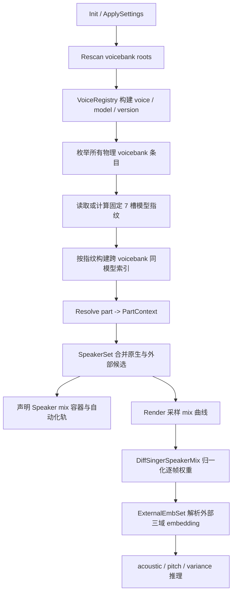

# 同模型跨 Voicebank 说话人混合

> 状态：已实现
>
> 适用范围：DiffSingerForTuneLab 的 speaker embedding 混合

## 1. 功能边界

本功能不是“跨模型混合”，而是“同一模型、跨不同 voicebank 混合”。

两个 voicebank 只有在非声码器 ONNX 内容指纹完全一致时，才会互相提供说话人候选。换言之：

- voicebank 是磁盘上的物理资源包，拥有独立的根目录、元数据和 `.emb` 文件；
- model 是 acoustic、duration、pitch、variance 等 ONNX 计算图及权重；
- 不同 voicebank 可以封装同一套 model，但携带不同 speaker embedding；
- 只有这种“模型相同、voicebank 不同”的组合才能使用本功能；
- ONNX 指纹不同的 voicebank 不兼容，即使 `tunelab.yaml` 使用了相同 model id 也不会互混。

兼容性以内容为准，不以文件夹名、文件名、显示名或 model id 为准。声码器不参与判定，因此两个兼容 voicebank 可以使用不同 vocoder。

### 1.1 目标

- 在不复制整个模型的前提下，把其他 voicebank 中的 speaker embedding 加入当前 part。
- acoustic、pitch、variance 三个域使用同一组逐帧混合权重。
- UI 声明期间只查内存索引，不读取或哈希大型 ONNX。
- 外部 voicebank 暂时离线时保留工程中的选择和自动化数据。
- 原生 speaker 与外部 voice 标识冲突时始终优先原生 speaker。

### 1.2 非目标

- 不允许不同 ONNX 模型之间混合 embedding。
- 不根据音色相似度、model id 或人工声明猜测兼容性。
- 不混合 duration phonemizer 的 speaker 条件；逐帧混合用于 acoustic、pitch 和 variance 的 `spk_embed`。
- 不要求兼容 voicebank 使用同一 vocoder。

## 2. 术语与标识

| 名称 | 含义 | 稳定键 |
|---|---|---|
| 当前 voicebank | part 当前 model/version 解析到的物理根目录 | `ResolvedVoice.RootPath` |
| 原生 speaker | 当前 voicebank 自己暴露的 speaker | dsconfig speaker 的 suffix |
| 外部 voice | 来自另一个兼容 voicebank 的 voice | 全局 `VoiceId` |
| speaker entry | voice 在目标 voicebank 中实际对应的 dsconfig speaker 条目 | `SpeakerEntry` |
| 模型指纹 | 固定 7 槽非声码器 ONNX 内容哈希 | `ModelFingerprint` |
| 孤儿项 | 工程已持久化、当前扫描结果中不再可用的混音键 | 原持久化键 |

原生和外部候选故意使用不同的键空间：

- 原生候选使用 speaker suffix，例如 `Miku`；
- 外部候选使用全局 voice id，例如 `singer-luka`；
- 若外部 voice id 与任一原生 suffix 相同，外部候选被过滤，原生解析优先。

part 属性中的容器键为 `speaker_mix`，每个已选项只表达“存在”。对应自动化轨键为 `mix:<key>`。

## 3. 用户界面与操作流程

### 3.1 候选出现条件

用户选定 voice、model 和 version 后，插件先解析出当前物理 voicebank，再从预计算索引取得兼容外部 voice。

part 属性面板在满足任一条件时显示 “Speaker mix”：

1. 当前 voicebank 有非默认的原生 speaker；
2. 存在同模型的其他 voicebank，并提供可用外部 voice；
3. 工程中已有需要保留的 `speaker_mix` 项，即使当前候选已离线。

默认 speaker 不出现在可添加列表中，因为它始终作为剩余权重的承接者。

### 3.2 候选显示

| 候选类型 | part 属性中的显示 | 自动化轨显示 | 键 |
|---|---|---|---|
| 同 voicebank 原生 speaker | voice/speaker 显示名 | 显示名 | speaker suffix |
| 其他兼容 voicebank 的 voice | `[EXT] ` + voice 显示名 | voice 显示名 | voice id |
| 当前不可用的孤儿项 | `⚠ ` + 原键 | `⚠ ` + 原键，灰色 | 原持久化键 |

用户在 “Speaker mix” 容器中添加候选后：

1. `speaker_mix` 中出现该 presence 项；
2. 自动化面板新增一条 `mix:<key>` 曲线；
3. 曲线范围为 `[0,1]`，默认值为 `0`；
4. 绘制曲线后，目标 speaker 在相应时间范围参与三域 embedding 混合。

从容器移除候选后，对应自动化声明消失。工程数据的增删由 TuneLab 属性系统负责，插件不会在声明回调中主动改写 part 数据。

### 3.3 多条曲线的权重规则

对每一帧，所有已选混音曲线先读取为目标权重。NaN 或超出采样长度的值按 `0` 处理。

设目标曲线之和为 `S`：

- `S <= 1`：默认 speaker 权重为 `1 - S`；
- `S > 1`：所有目标权重除以 `S`，默认 speaker 权重为 `0`；
- 最终每帧全部 speaker 权重之和恒为 `1`。

每个域独立解析 embedding，再使用同一组权重计算：

```text
embedding(frame) = Σ weight[speaker, frame] * embedding_domain[speaker]
```

因此一条 speaker mix 曲线会同步影响 acoustic、pitch 和 variance，但三个域可以拥有不同 hidden size 和不同 `.emb` 文件。

### 3.4 Voicebank 离线与孤儿保留

当外部 voicebank 被移动、卸载、损坏或变得不兼容时，已经持久化的混音项不会被插件删除：

- part 属性中保留为 `⚠ <key>`；
- 自动化轨保留并显示为灰色；
- 合成时不把孤儿项加入 `DiffSingerSpeakerMix`，因此不会错误解析到其他 speaker；
- 用户仍可在 part 属性中移除该项；
- 原 voicebank 恢复并重新扫描后，相同 key 会重新成为正常候选，原曲线继续生效。

如果用户切换 voice/model 后，某个已选 key 恰好成为新的默认 speaker，该 key 会暂时隐藏，不会被标记为孤儿，也不会作为混音轨重复计权。再次切回其他默认 speaker 时，原选择仍可恢复。

## 4. 总体实现流程



关键分层：

- 扫描层负责确定有哪些物理 voicebank；
- 指纹层只回答不同 voicebank 是否承载同一模型；
- 注册表层提供 voice id、显示名、speaker entry 和版本信息；
- 声明层把候选映射为 part 属性和自动化轨；
- 合成层采样曲线并按域解析 embedding。

## 5. 同模型判定

### 5.1 固定 7 槽指纹

每个 voicebank 的 `ModelFingerprint` 是以下有序 XxHash64 序列：

| 槽位 | 文件来源 |
|---:|---|
| 0 | 根 dsconfig 引用的 acoustic ONNX |
| 1 | `dsdur/dsconfig.yaml` 的 `linguistic` ONNX |
| 2 | `dsdur/dsconfig.yaml` 的 `dur` ONNX |
| 3 | `dspitch/dsconfig.yaml` 的 `linguistic` ONNX |
| 4 | `dspitch/dsconfig.yaml` 的 `pitch` ONNX |
| 5 | `dsvariance/dsconfig.yaml` 的 `linguistic` ONNX |
| 6 | `dsvariance/dsconfig.yaml` 的 `variance` ONNX |

预测器目录不存在或对应字段为空时，该槽写入 `MissingSlot`，后续槽位不会前移。因此以下情况都不会错误坍缩为同一序列：

- 只有 duration predictor 与只有 pitch predictor；
- predictor 完全缺失与 predictor 存在但 role 不同；
- 相同文件集合以不同 role 组合。

文件名可以不同，只要对应槽位的文件内容相同；反之，文件名相同但内容不同仍判定为不兼容。

### 5.2 失败策略

- predictor 目录缺失：写两个 `MissingSlot`，属于可验证结构；
- role 字段缺失：对应槽写 `MissingSlot`；
- dsconfig YAML 无法解析：当前 voicebank 指纹不可验证，整包跳过；
- ONNX 缺失或不可读：当前 voicebank 指纹计算失败，整包跳过；
- 一个坏 voicebank 只影响自己，`PopulateFingerprints` 的逐包 `try/catch` 不会中止整个兼容索引。

损坏包会记录 Warning。不能把坏 YAML 当作“预测器缺失”，否则可能把未知结构错误判为兼容。

### 5.3 磁盘缓存

指纹缓存位于 `UserDataRoot/Cache/fingerprints.json`，当前版本为 v3。缓存条目保存：

- 固定 7 槽 hash；
- 依赖文件大小；
- 依赖文件最后修改时间的 UTC ticks；
- 条目时间戳。

用于失效判断的依赖包括：

- 根 `dsconfig.yaml` 与 acoustic ONNX；
- 每个 predictor 的 `dsconfig.yaml`、linguistic ONNX 和 role ONNX；
- predictor 缺失时使用固定的 `-1` 占位。

dsconfig 必须参与校验，因为它决定实际引用哪个 ONNX。只校验 ONNX 元数据会在配置改指向另一文件时错误复用旧指纹。

`Rescan` 会清空进程内指纹和兼容索引，再校验磁盘缓存。缓存版本、文件大小或 mtime 不匹配时重新计算内容哈希；新增或更新的条目最后批量写回一次。

## 6. 兼容候选索引

`BuildCompatibilityIndex` 在 `Init` / `ApplySettings -> Rescan` 阶段一次性执行：

1. `VoiceRegistry.EnumeratePackages` 展开所有 voice、model 和 version 对应的物理根目录；
2. 同一 root 只计算一次指纹；
3. 对当前条目遍历其他物理 voicebank；
4. root 相同、voice id 相同或指纹不同的条目跳过；
5. 找到相同指纹后才按 voice id 去重；
6. 保存 `ExternalVoice(VoiceId, Display, Color, RootPath, SpeakerEntry, Version)`。

兼容索引的结构为：

```text
current rootPath
└─ current voiceId
   └─ compatible ExternalVoice[]
```

UI 声明和 Render 只在该内存索引中查找，不会在高频回调中读取 ONNX、计算 hash 或写磁盘缓存。

## 7. 外部 Embedding 解析

`ExternalEmbSet` 在一次 Render 中按 `PartContext.CompatibleVoices` 懒构建，并分别缓存 acoustic、pitch、variance embedding。

### 7.1 Native 优先

构造 `ExternalEmbSet` 时，当前 `SpeakerSet` 的全部原生 suffix 和默认 suffix 都加入排除集合。`TryAcoustic`、`TryPitch`、`TryVariance` 只有在 key 确实属于外部 voice 时才返回 `true`。

这保证解析链为：

| 域 | 外部 key | 非外部 key |
|---|---|---|
| acoustic | `ExternalEmbSet.TryAcoustic` | `VoiceModels.GetSpeakerEmbeddingBySuffix` |
| pitch | `ExternalEmbSet.TryPitch` | `DiffSingerPredictor.GetEmbedding` |
| variance | `ExternalEmbSet.TryVariance` | `DiffSingerPredictor.GetEmbedding` |

安装兼容外部 voicebank 但不选择混音项时，默认原生 embedding 路径完全不变。

### 7.2 三域独立 hidden size

三个域分别使用自己的 hidden size：

- acoustic：`VoiceModels.HiddenSize`；
- pitch：`dspitch.HiddenSize`，无 predictor 时回退 acoustic hidden；
- variance：`dsvariance.HiddenSize`，无 predictor 时回退 acoustic hidden。

外部 `.emb` 按对应域的 hidden size 读取，短文件尾部补零，长文件截断。这样不会假设三个导出模型拥有相同 hidden size。

### 7.3 文件定位

对于 external voice，acoustic 首先读取：

```text
<external root>/<SpeakerEntry>.emb
```

pitch / variance 首先读取：

```text
<external root>/<subdir>/<SpeakerEntry>.emb
```

若 predictor 内部 speaker 条目与 acoustic 条目名称不同，则解析 predictor `dsconfig.yaml` 的 `speakers` 表，按 suffix 查找替代 entry。

外部 key 已确认存在但该域 `.emb` 缺失或不可读时，返回该域 hidden size 的零向量并缓存，不会错误回退到当前 voicebank 的同名原生 speaker。

## 8. 生命周期与并发

- `Init` 和扩展设置变更都会触发 `Rescan`；
- `Rescan` 重建 registry，并清空 config、内存指纹和兼容索引；
- 指纹字典与兼容索引的读写受 `mFingerprintLock` 保护；
- 新索引完整构建后再整体发布；构建期间查不到候选时安全返回空列表；
- 合成会话在 model/version 或 part 属性变更后重新解析 `PartContext`；
- 自动化订阅随当前原生/外部候选动态增删，孤儿轨不参与合成订阅。

## 9. Voicebank 制作要求

要让 voicebank A 与 B 互相提供 speaker，至少需要：

1. A/B 的固定 7 槽 ONNX 内容逐槽相同，缺失槽结构也相同；
2. A/B 位于不同物理根目录；
3. 外部 voice 有可区分的全局 voice id；
4. acoustic 及需要混合的 predictor 域带 `spk_embed`，并提供对应 `.emb`；
5. predictor speaker entry 与 acoustic 不同名时，suffix 必须能在 predictor `speakers` 表中匹配。

允许不同的内容：

- `.emb` 文件，这正是跨 voicebank 混合的目标；
- character、portrait、显示名和 i18n；
- vocoder；
- ONNX 文件名，只要对应槽位内容相同。

一个典型布局如下：

```text
Voicebank-A/                       Voicebank-B/
  dsconfig.yaml                     dsconfig.yaml
  acoustic.onnx        ==content=>  acoustic.onnx
  speaker-a.emb                     speaker-b.emb
  dspitch/                          dspitch/
    linguistic.onnx    ==content=>    linguistic.onnx
    pitch.onnx         ==content=>    pitch.onnx
    speaker-a.emb                     speaker-b.emb
  dsvariance/                       dsvariance/
    ...                ==content=>    ...
```

## 10. 常见问题排查

| 现象 | 检查项 |
|---|---|
| 外部 voice 不出现 | 是否重新扫描；root 是否不同；7 槽指纹是否一致；坏 YAML/缺失 ONNX 是否产生 Warning |
| 同 model id 仍不出现 | model id 不参与兼容判定，检查实际 ONNX 内容 |
| 候选显示 `⚠` | 原 voicebank 当前离线、损坏、不兼容，或 voice id 已不再暴露 |
| 曲线存在但无效果 | 曲线是否非零；对应模型域是否有 `spk_embed`；外部 `.emb` 是否存在且非零 |
| 外部 voice 与原生同名时不出现 | native suffix 与 external voice id 碰撞，设计上原生优先 |
| 修改 dsconfig/ONNX 后候选仍旧 | 触发 Rescan；缓存会按 dsconfig、文件大小和 UTC ticks 自动失效 |
| 一个坏包导致其他候选消失 | 检查日志；坏包应只被逐包跳过，若全局索引为空属于异常行为 |

## 11. 代码入口与测试

| 文件 | 职责 |
|---|---|
| [ModelFingerprint.cs](../ModelFingerprint.cs) | 固定 7 槽内容指纹与 v3 磁盘缓存 |
| [DiffSingerVoiceEngine.cs](../DiffSingerVoiceEngine.cs) | Rescan、缓存校验、兼容索引与 PartContext 注入 |
| [VoiceRegistry.cs](../VoiceRegistry.cs) | 物理 voicebank 条目枚举与 ExternalVoice 数据契约 |
| [DiffSingerDeclarations.cs](../DiffSingerDeclarations.cs) | Speaker mix 属性、候选、孤儿与自动化声明 |
| [ExternalEmbSet.cs](../ExternalEmbSet.cs) | 外部 voice 三域 `.emb` 定位、读取与缓存 |
| [DiffSingerSpeakerMix.cs](../DiffSingerSpeakerMix.cs) | 逐帧权重归一与 embedding 加权 |
| [DiffSingerSynthesisSession.cs](../DiffSingerSynthesisSession.cs) | 采样曲线并向 acoustic/pitch/variance 注入解析器 |

现有单元测试覆盖：

- 固定槽位、缺失 predictor、不同 role 不坍缩、坏 YAML 不冒充缺失；
- 生产 `ModelFingerprint` 的相等性、hash 和 Dictionary key 行为；
- native key 排除、三域独立 hidden size、外部 `.emb` 缺失零向量；
- speaker mix 的默认补权、超额归一、多帧与零权重行为。
